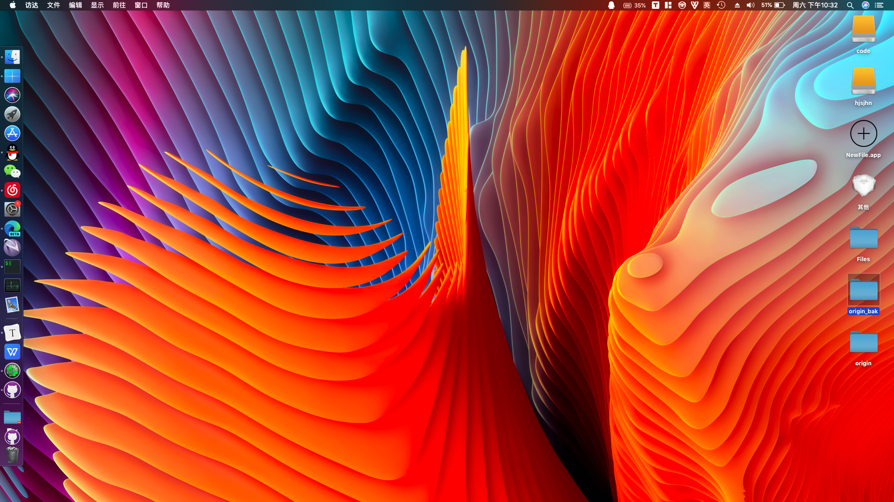
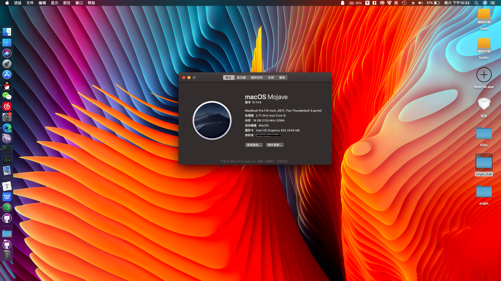
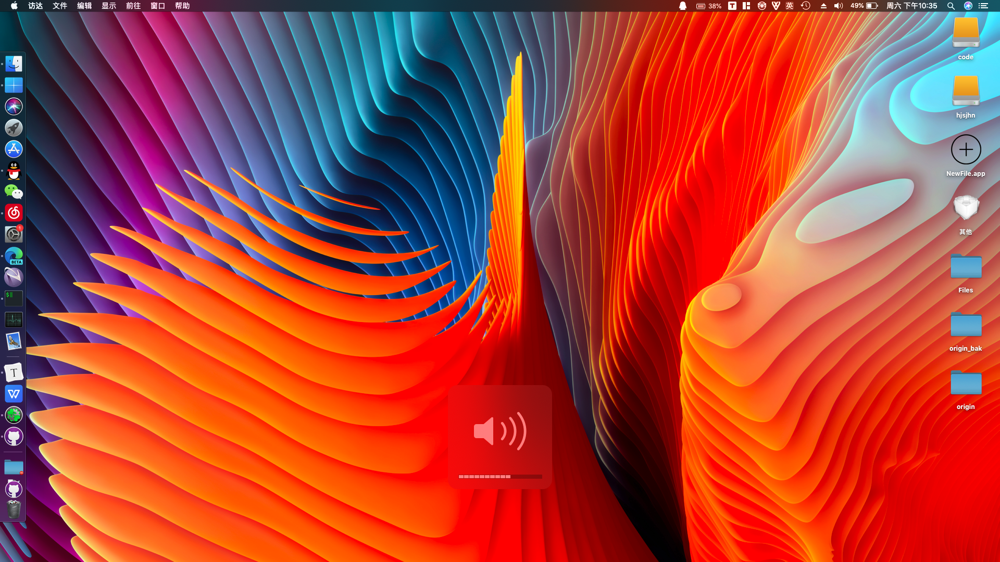
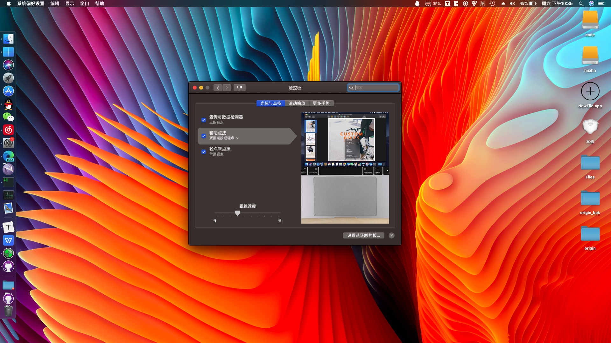
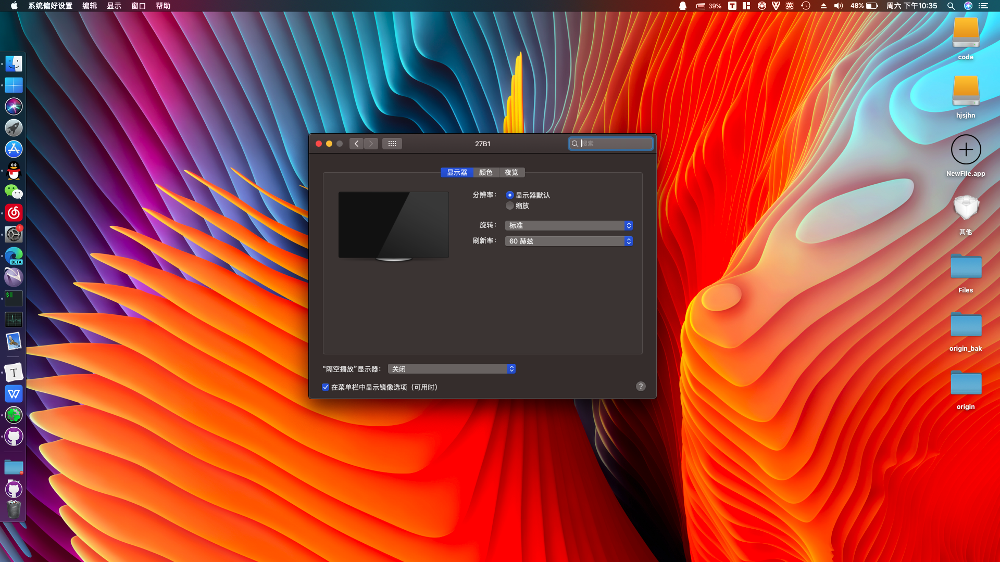

# 适合机型

Lenovo **ThinkPad E570**

CPU: i5-7200U , 集显: Intel HD 620 , 独显: NVIDIA GeForce 940MX

无线网卡: Intel Dual Band Wireless-AC 8265 , 有线网卡: Realtek PCIe GBE Family Controller

# 完成情况

**独显无解，无线网卡无解**

集显、有线网卡可以识别

触摸板、键盘可以识别

声卡正常能够调整声音大小，暂时无破音现象

屏幕亮度可以调整，实测能够通过 HDMI 外接屏幕

电池信息正常

蓝牙可以识别，具体驱动在[这个仓库](https://github.com/zxystd/IntelBluetoothFirmware)， **蓝牙驱动请自己下载**

# 使用方法

下载此 repo ，将文件复制进 EFI/CLOVER/

# 资料来源

[efi和初始的config.plist](https://club.lenovo.com.cn/thread-4761791-1-1.html)

[安装教程](https://club.lenovo.com.cn/thread-5632393-1-1.html)

帮忙搞定DSDT补丁的老哥QQ：3467365604 （DSDT补丁搞完才有电池和触摸板识别）

# 截图

